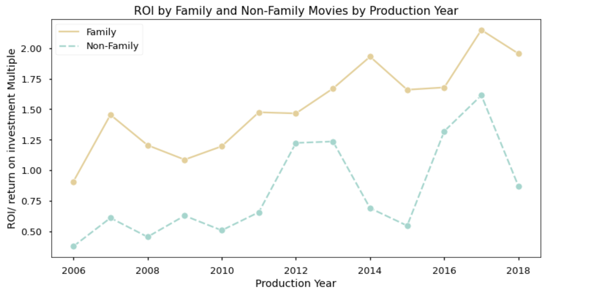

# Microsoft Corp. Movie Studio Analysis

**Author**: [Heath Rittler](mailto:hrittler@gmail.com)


## Overview

This project analyzes box office data for Microsoft Corp., who would like to begin their own movie studio.  A descriptive analysis of box office data shows that movies of a certain rating, and distribution method can impact the expected ROI/ return from the original investment.  Thus making the venture into original content a successful business venture.


## Business Problem

Microsoft wants to create original video content.  However, they do not know much about creating movies, or which types of movies are most successful at the box office.  The purpose of this analysis is to evaluate box office data and to provide Microsoft with recommendations on which types of content would make them most successful in their endeavor.


## Data

The OpusData Movie dataset contains basic data for 1,900 movies.  This is a free/ academic use only dataset, which is a subset of a larger dataset that is available for purchase.  The data includes titles, ids, box office stats for domestic and international box office revenue, production costs, rating information, along with production details.  The dataset includes movies with production years between 2006 and 2018, and limited to movies with a production budget greater than or equal to $10 million.


## Methods

This project uses descriptive analysis, including description of trends over time. This provides a useful overview of which type of content, and where the studio should focus their initial efforts to ensure expected ROI.


## Results

Most movies that were released in this data set (between 2006 and 2018, and have a budget of over $10M) are profitable.  However, when you start to look at the type of content (rating) of the movies, you can begin to dicern a higher probability of profitability.  Something that is really important for a company that is just beginning their content journey.  Over time you can see that movies rated for the family do better from and ROI perspective than those movies targeted for audiences over the age of 17.



When you pair a movie's rating, along with how it is distributed and it's ability to franchise, you improve the chances of having a very profitable film compared to movies that have a more targeted audience (i.e. NC-17 and R).  Median internation box office revenue is consistently higher than non-family movies as well.  And we know that the international box office plays a big part in total box office revenue, accounting for more than half of gross revenue.


Now that we know we need international movies that appeal to a international audience, the final performance variable I evaluated was if the movie had a sequel or not.  International Family Movies that have a sequel experience a return of almost twice the amount of movies (international, family) without a sequel.


These 3 variables have a considerable impact on ROI and total revenue, which will optimize success for Microsoft from the start.

## Conclusions

This analysis leads to three recommendations for the initial content selection and distribution for Microsoft:

- **Create family movies that have the highest ROI to maximize initial investment & early profitability.** Movies that are rated G, PG, and PG-13 have the broadest audience available to them.  Focus in these areas and maximize opportunity to be profitable.
- **Focus on family movies that are appealing to an international audience.** Considering that 30% of the world's population is under the age of 17, you start to significanly limit the audience that would be able target.  In addition, limiting to just domestic box offices, your box office opportunity is even lower.  Releasing to international box offices will increase your revenue, and improve your profitability factors.
- **Develop franchise movies to optimize box office performance, and additional opportunities for monetization.** A compounding factor with the aforementioned suggestions is being able to franchise the film.  This adds another component of revenue, and franchise opportunities.  


## Moving Forward

Further analyses could yield additional insights to further improve success at Microsoft:

- **Look at production studio data to determine inital success of movies types within the suggested rating categories.** 
- **Understand review data and how it impacts success for both studio, and franchises.**
- **Look at sequel success in relation to cast consistency;  are people going to see the movie because of the story, or the cast.**


## For More Information

The full analysis is located in the [Jupyter Notebook](./phase_1_project.ipynb) or review this summary [presentation](./.pdf).

For additional info, contact Heath Rittler at [hrittler@gmail.com](mailto:hrittler@gmail.com)


## Repository Structure

```
├── data
├── images
├── README.md
├── ###.pdf
└── ###.ipynb
```